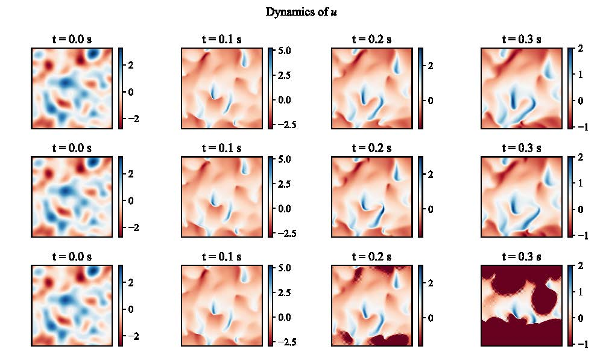
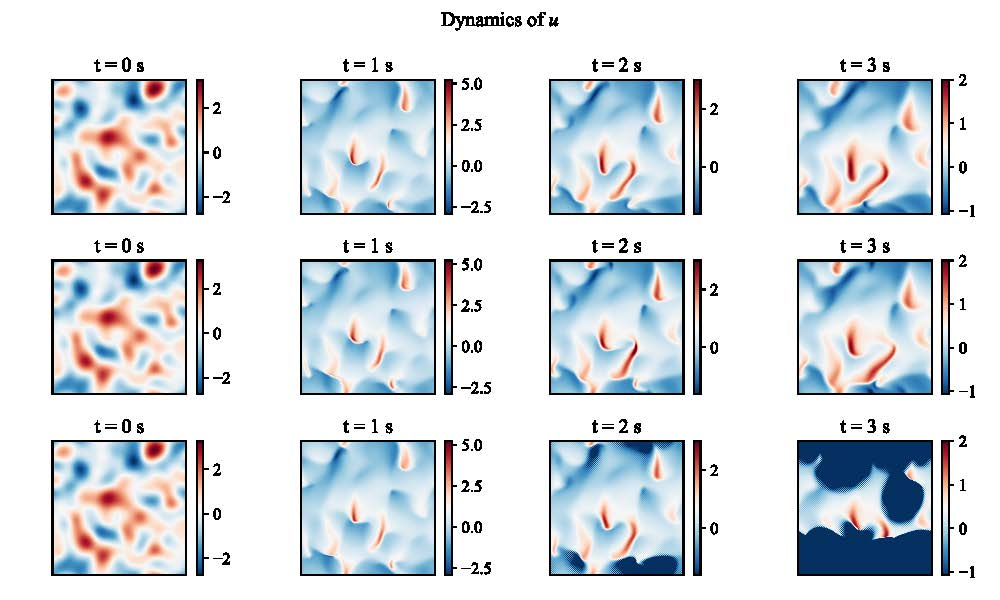
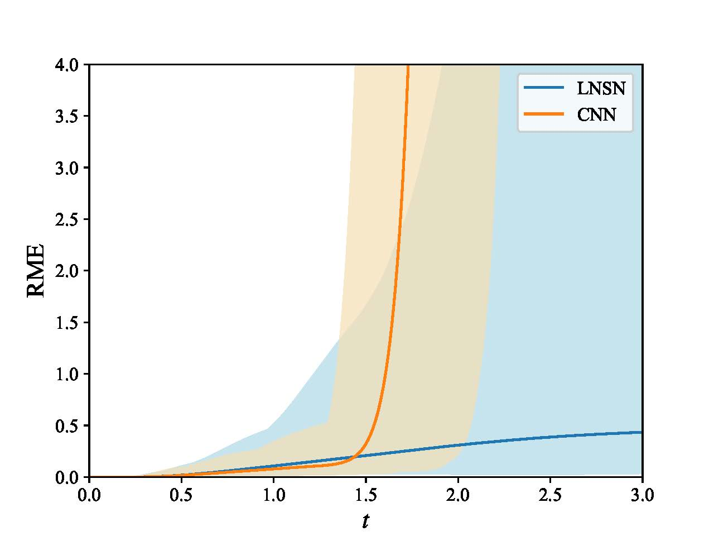

### Case 8: Two-dimensional Burgers equation with reactive source

$$
\boldsymbol{u}_t + \boldsymbol{u}\cdot \nabla\boldsymbol{u} = \nu \Delta\boldsymbol{u} + \boldsymbol{s}(\boldsymbol{u}) \\
\boldsymbol{s}(\boldsymbol{u}) = \gamma \boldsymbol{A} \cdot \boldsymbol{u} \\
\boldsymbol{A} = \begin{bmatrix}
1-|\boldsymbol{u}|^2 & |\boldsymbol{u}|^2   \\
-|\boldsymbol{u}|^2  & 1-|\boldsymbol{u}|^2 \\
\end{bmatrix} \\
\boldsymbol{u}(x,y,t_0) = \boldsymbol{u}_0(x,y)
$$

#### Numerical details

* $\mu=0.015$
* $\gamma=0.1$
* $\delta t=0.01$
* T = 3 s, steps = 300
* Mesh: uniform mesh of $128\times 128$
* Domain: $[0,2\pi]\times[0,2\pi]$

#### Initial condition

* Similar with Case 5: randomly fields

#### Files introduction

* `2d_burgers_reactive_source_Periodic.py`:  Numerical solutions for 2d burgers equation with reactive source, periodic boundary, Fourier Spectral method.
* `LNSN.py`:  Linear convolutional neural network
  * `Network` folder/trained_network, number of layers [1,2,3], number of nodes per layer [8,16,32,64].
* `validation_LNSN.py`:  validation for LNSN
* `validation_CNN.py`:  validation for CNN
  * `error`: folder/error_text, number of layers $\alpha=[1,2,3]$, number of nodes per layer $\beta = [8,16,32,64]$ .
* `PLOT.py`: plot contours (one of test data samples) for a short time, $T\in[0,0.3]$
* `PLOT_LONG.py`: plot contours (one of test data samples) for a long time,  $T\in[0,3]$
* `report.py`: plot error varying with time
* `report_dependence.py`: report mean, min, max error for different parameters of $\alpha$ and $\beta$， shown in table

#### Figure

Figure: Comparison of the predictions from LNSN and the standard CNN. The first row shows the numerical results, second row shows the predictions obtained by LNSN, and the last row shows that of CNN.

Figure: Prediction error of the LNSN and the standard CNN. The shadow area indicates the minimum and maximum error among $1000$ test samples.

#### Table

Table: The RME for LNSN predictions at $t = 3\ s$.

<table>
    <tr>
        <td rowspan="2">&alpha;</td>
        <th colspan="3">1 hidden layer</td>
        <th colspan="3">2 hidden layers</td>
	    <th colspan="3">3 hidden layers</td>
    </tr>
    <tr>
        <td>Mean</td>
        <td>Min</td>
	    <td>Max</td>
        <td>Mean</td>
        <td>Min</td>
	    <td>Max</td>
        <td>Mean</td>
        <td>Min</td>
	    <td>Max</td>
    </tr>
    <tr>
        <td> 8 </td>
        <td> >106 </td>
        <td> 0.110 </td>
	    <td> >107 </td>
        <td> >102 </td>
        <td> 0.017 </td>
	    <td> >103 </td>
        <td> 0.106 </td>
        <td> 0.018 </td>
	    <td> 0.741 </td>
    </tr>
    <tr>
        <td> 16 </td>
        <td>> 1.378 </td>
        <td> 0.048 </td>
	    <td> 33.602 </td>
        <td> 0.180 </td>
        <td> 0.032 </td>
	    <td> 0.815 </td>
        <td> 0.128 </td>
        <td> 0.015 </td>
	    <td> 0.766 </td>
    </tr>
    <tr>
        <td> 32 </td>
        <td> 0.434 </td>
        <td> 0.030 </td>
	    <td> 5.611 </td>
        <td> 0.349 </td>
        <td> 0.018 </td>
	    <td> 5.716 </td>
        <td> 0.154 </td>
        <td> 0.019 </td>
	    <td> 1.318 </td>
    </tr>
    <tr>
        <td> 64 </td>
        <td> 0.118 </td>
        <td> 0.010 </td>
	    <td> 2.203 </td>
        <td> 1.702 </td>
        <td> 0.021 </td>
	    <td> >102 </td>
        <td> 0.123 </td>
        <td> 0.012 </td>
	    <td> 1.018 </td>
    </tr>

